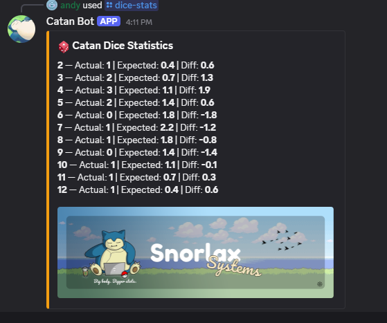
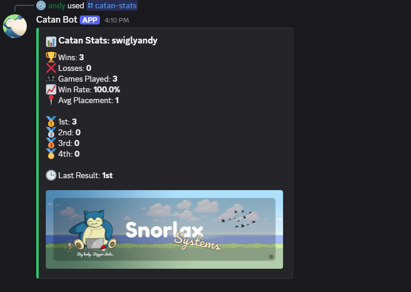
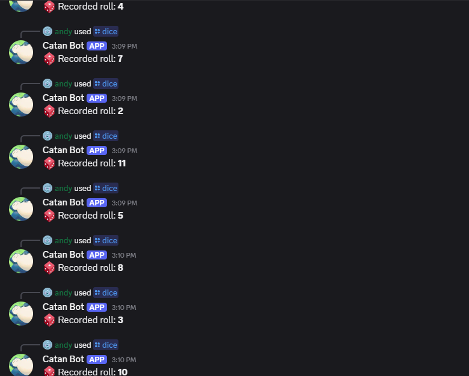
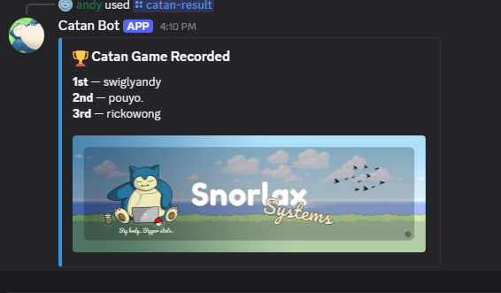

# Catan Analytics Discord Bot

A Discord bot that tracks and analyzes **Catan game performance**, including player stats, placements, and dice roll probability.

Features

- Track player performance (wins, losses, placements)
- Calculate win rates and average placement
- Dice roll tracking with expected vs actual probability
- Luck analysis (luckiest / unluckiest rolls)
- Leaderboards for competitive insights
- JSON-based data storage (expandable to database)

Tech Stack

- **Node.js**
- **discord.js**
- **JavaScript**
- **JSON (data storage)**

Example Commands

- /catan-result → submit game results
- /catan-stats → view player stats
- /dice-roll → log dice rolls
- /dice-stats → view dice analytics

📊 Data Insights

The bot provides advanced analytics such as:

- Win rate per player
- Average placement
- Dice roll distribution vs expected probability
- Luck differential analysis

## Screenshots of Catan Bot in use

### Dice Roll Graph

### Dice Analytics

### Player Statistics

### Dice Roll Command

### Game Results

